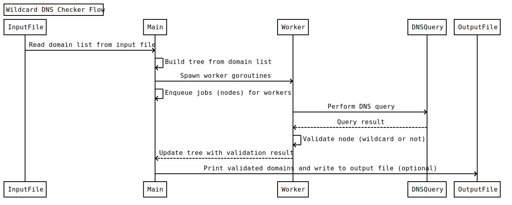

# Subsift
This tool was developed as an alternative method for removing wildcards from a list of subdomains. 
It achieves this by identifying a specific domain node as a wildcard, marking it accordingly, and refraining from sending additional queries to that node. This method can be more efficient than the conventional "resolve and count determined subdomain occurrences" technique in certain situations.

Furthermore, this wildcard filtering approach offers benefits for automation, as it can handle inputs from multiple base domains without being restricted to a single base domain. It can also detect wildcards even at low counts, which wouldn't surpass the wildcard threshold for other tools.




# Installation

```
go install github.com/c3l3si4n/subsift@HEAD
```
